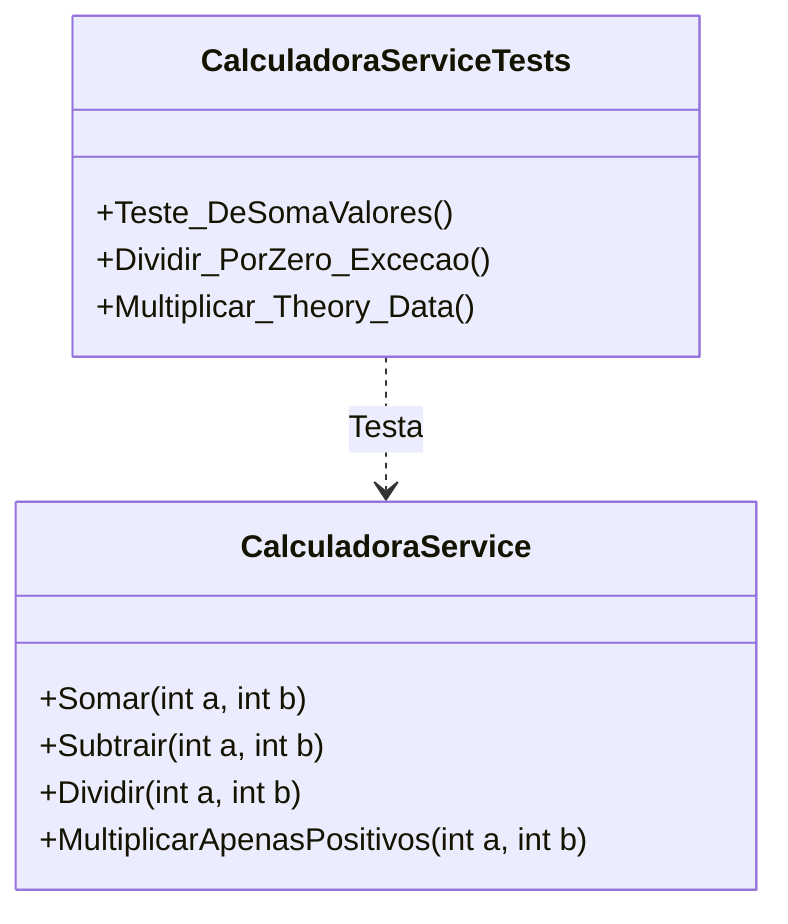

# 🧮 Calculadora - Estudo de Testes Unitários com xUnit


## 📖 Sobre o Projeto

Este repositório consiste em um projeto prático para o estudo aprofundado de **Testes Unitários** no ecossistema .NET. O objetivo principal não é a complexidade da calculadora em si, mas sim a aplicação de padrões de qualidade de código, cobertura de testes e validação de regras de negócio.

O projeto separa claramente a regra de negócio (`Calculadora.Core`) da camada de testes (`Calculadora.Tests`), garantindo desacoplamento e testabilidade.

---

## 🧠 Conceitos Aplicados

Durante o desenvolvimento, foram aplicados conceitos fundamentais de QA (Quality Assurance) e desenvolvimento de software:

### 1. Padrão AAA (Arrange, Act, Assert)
Todos os testes seguem rigorosamente a estrutura de três etapas para manter a legibilidade e organização:
* **Arrange:** Configuração do cenário e instanciar objetos.
* **Act:** Execução do método a ser testado.
* **Assert:** Validação se o resultado obtido é igual ao esperado.

### 2. Fact vs Theory
Utilização dos principais atributos do **xUnit** para diferentes cenários:
* `[Fact]`: Testes que são sempre verdadeiros com os mesmos dados de entrada (ex: Soma simples, Divisão por zero).
* `[Theory]`: Testes datadriven (orientados a dados) que permitem validar o mesmo método com múltiplos conjuntos de entradas usando `[InlineData]`.

### 3. Validação de Exceções
Testes específicos para garantir que o sistema falhe graciosamente e lance as exceções corretas, como `DivideByZeroException` e exceções personalizadas (`NumeroNegativoException`).

### 4. Mocking e Injeção de Dependência
Preparação para testes de componentes avançados (`CalculadoraAvancada`) utilizando interfaces (`IConfiguracaoRepository`) para isolar comportamentos externos.

---

## 📂 Estrutura da Solução


## 💻 Exemplo de Código

Abaixo, um exemplo de como o `[Theory]` foi utilizado para reduzir a repetição de código, testando múltiplos cenários de soma e validação de erros em um único método de teste:

```csharp
[Theory]
// Cenário 1: Erro no primeiro parâmetro
[InlineData(-5, 10, "O primeiro número não pode ser negativo.")]
// Cenário 2: Erro no segundo parâmetro
[InlineData(10, -5, "O segundo número não pode ser negativo.")]
public void MultiplicarApenasPositivos_ComNumeroNegativo_DeveLancarException(
    int a, int b, string mensagemEsperada)
{
    // Arrange
    var calculadora = new CalculadoraService();

    // Act
    var excecao = Assert.Throws<NumeroNegativoException>(() =>
    {
        calculadora.MultiplicarApenasPositivos(a, b);
    });

    // Assert
    Assert.Equal(mensagemEsperada, excecao.Message);
}
```
## 🛠 Tecnologias Utilizadas

* **Linguagem:** C# (.NET 9.0)
* **Framework de Teste:** xUnit
* **Asserções:** xUnit Assertions
* **Mocking:** Moq (Integrado ao projeto para cenários avançados)
* **Coverage:** Coverlet

---

## 🚀 Como Executar os Testes

Para rodar a suíte de testes e verificar a integridade do código, utilize o comando abaixo no terminal:

```bash
dotnet test
```
## 👨‍💻 Autor
Desenvolvido por Derick Dutra como parte dos estudos de Ciência da Computação e aprofundamento em qualidade de software.
